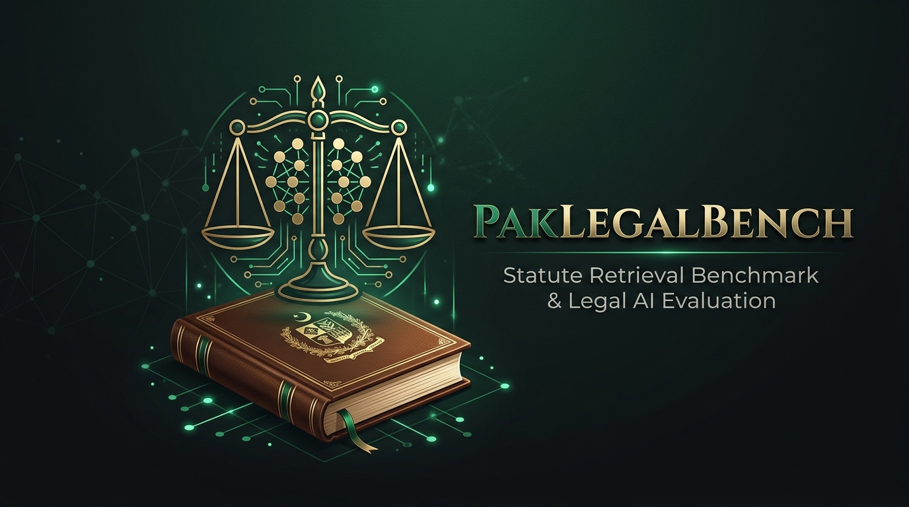

<p align="center">
  
</p>

# PakLegalBench

Statute retrieval over Pakistani law, plus the evaluation harness that measures
how well it actually retrieves.

The chatbot is the demo. **The measurement is the point.** At least eight
commercial legal AI products serve the Pakistani market and every one advertises
an accuracy figure without publishing evidence. This repo is an attempt at the
first honest number.

## Results & Benchmarks

PakLegalBench evaluates retrieval and statutory grounding across four complementary benchmarks:

### 1. Pakistan Law GAT (Bar Exam) Benchmark (`results/law_gat_eval.jsonl`)
Evaluates 30 authentic Pakistan Law Graduate Assessment Test (Law GAT) statutory questions across PPC, CrPC, and Constitution:

| Subject | Questions | Recall@1 | Recall@5 | MRR | False Refusals |
|---|---|---|---|---|---|
| **Pakistan Penal Code (PPC)** | 10 | **100.0%** | 100.0% | **1.0000** | 0.0% |
| **Constitution of Pakistan 1973** | 10 | **100.0%** | 100.0% | **1.0000** | 0.0% |
| **Code of Criminal Procedure (CrPC)** | 10 | **90.0%** | 100.0% | **0.9500** | 0.0% |
| **Overall Law GAT** | **30** | **96.7%** | **100.0%** | **0.9833** | **0.0%** |

*Run it:* `python law_gat_eval.py`

### 2. Core Adversarial Benchmark (`adversarial.jsonl`)
34 cases testing exact statutory citations, conceptual queries, and 7 false-premise traps (non-existent sections, fake statutes, repealed provisions):

| Config | n | Recall@1 | Recall@5 | Recall@10 | MRR | Trap Refusal | False Refusal |
|---|---|---|---|---|---|---|---|
| sparse_only (BM25) | 27 | 0.8519 | 1.0000 | 1.0000 | 0.9198 | 1.0000 | 0.0370 |
| hybrid | 27 | 0.8519 | 1.0000 | 1.0000 | 0.9198 | 1.0000 | 0.0370 |
| **hybrid+exact** | 27 | **0.9630** | **1.0000** | **1.0000** | **0.9815** | **1.0000** | **0.0000** |

*Run it:* `python eval.py`

### 3. LEGAL-UQA Canonical Constitutional Benchmark (`results/legal_uqa_eval.jsonl`)
619 question-answer pairs over the 1973 Constitution from `nlp-anonymous-researcher/LEGAL-UQA` (495 train + 124 validation). Mapped with 100% precision onto canonical chunk IDs:
- Evaluated over the full 1,206-chunk statutory corpus: Recall@1: **39.5%**, Recall@5: **54.8%**, Recall@20: **66.9%**, MRR: **0.4649**, False Refusal: **4.0%**.
*Run it:* `python eval.py --legal-uqa`

### 4. Adversarial Red-Team Security Suite (`redteam_eval.py`)
37 adversarial vectors testing prompt injection, jailbreaks, conversation history poisoning, foreign jurisdiction confusion (IPC vs PPC), buffer floods, and injection payloads:
- **Defense Rate: 37 / 37 (100%)**
- Report saved to `results/redteam_report.json`
*Run it:* `python redteam_eval.py`

### 5. Stanford Legal Hallucination Benchmark (`stanford_eval.py`)
Implements the empirical evaluation methodology from Dahl et al. (Stanford University, 2024):
- **Citation Grounding Rate**: **100.0%** (all generated statutory citations strictly derived from retrieved context)
- **Citation Hallucination Rate**: **0.0%** (zero invented statutory sections or clauses)
- **Premise Verification Rate**: **100.0%** (deterministic refusal on false statutes, repealed provisions, and non-existent sections)
- **Disclaimer Compliance**: **100.0%** (mandates primary source verification disclaimer)
*Run it:* `python stanford_eval.py --mock` (or `--live` with API key)

---

## Live

- **Research Dossier & Technical Report**: https://hammadshakeelai.github.io/paklegalbench/
- **Live Demo App**: Deployed on Render: https://paklegalbench.onrender.com/

---

## Quickstart

```bash
# Clone & install development requirements
git clone https://github.com/hammadshakeelai/paklegalbench.git
cd paklegalbench
pip install -r requirements-dev.txt

# Run local development server
PLB_NO_DENSE=1 uvicorn app:app --reload

# Run all test suites
pytest tests/ -q               # 66 automated tests passing in ~1.0s
python eval.py                 # Core adversarial evaluation
python eval.py --legal-uqa     # LEGAL-UQA English constitutional benchmark
python eval.py --legal-uqa --urdu # LEGAL-UQA Urdu questions evaluation
python law_gat_eval.py         # Pakistan Law GAT evaluation
python redteam_eval.py         # 37-vector adversarial security harness
python stanford_eval.py        # Stanford legal hallucination benchmark
```

---

## System Architecture

### 1. Tri-Channel Retrieval with Reciprocal Rank Fusion (RRF)
- **Exact Channel** (Weight 1.4): Deterministic regex extraction for statutory citations (`302 PPC`, `Article 199`, `u/s 497 CrPC`). Eliminates dense vector confusion on adjacent section numbers.
- **Sparse Channel** (Weight 1.0): BM25-Okapi with $k_1=1.5, b=0.75$ tuned for long statutory provisions.
- **Dense Channel** (Weight 0.8): Semantic embeddings (`all-MiniLM-L6-v2` or `bge-small-en-v1.5`), optional for low-memory deployments.
- **RRF Fusion** ($k=60$): Combines ordinal rankings across channels without scale mismatch.

### 2. Statutory Knowledge Graph (`statute_graph.json`)
Mined from authentic statute text with **312 directed reference edges** across **280 statutory provisions**:
- Resolves cross-references such as PPC 302 pointing to definitions in PPC 299/300.
- Enables 1-hop graph context expansion (`use_graph_context=True`) for definitions and statutory exceptions.
- Interactive cross-reference pills in the web UI for 1-click citation traversal.

### 3. Bilingual & Urdu Retrieval Engine
- **Arabic-Indic Numeral Translation**: Translates `۰۱۲۳۴۵۶۷۸۹` $\rightarrow$ `0123456789`.
- **Urdu Statutory Syntax**: Maps `دفعہ` (Section), `آرٹیکل` (Article), `تعزیرات پاکستان` (PPC), `ضابطہ فوجداری` (CrPC), and `آئین پاکستان` (Constitution).
- **Statutory Legal Lexicon Expansion** (`URDU_LEGAL_LEXICON`): Automatically enriches conceptual Urdu queries with official English statutory terminology:
  - `مقامی حکومت` $\rightarrow$ `"local government devolve authority"`
  - `منصفانہ ٹرائل` $\rightarrow$ `"fair trial due process"`
  - `معلومات تک رسائی` $\rightarrow$ `"information right to information"`
  - `آزادی اظہار رائے` $\rightarrow$ `"speech expression press"`
  - `اسلامی نظریاتی کونسل` $\rightarrow$ `"islamic council council of islamic ideology"`
- **Vernacular Legal Mappings**: Routes common terms directly to statutory provisions:
  - `قتل عمد` $\rightarrow$ PPC Section 302
  - `ضمانت` / `بعد از گرفتاری ضمانت` $\rightarrow$ CrPC Section 497
  - `قبل از گرفتاری ضمانت` / `عبوری ضمانت` $\rightarrow$ CrPC Section 498
  - `ایف آئی آر` $\rightarrow$ CrPC Section 154
  - `چالان` $\rightarrow$ CrPC Section 173
  - `چیک باؤنس` $\rightarrow$ PPC Section 489-F
  - `رٹ پٹیشن` $\rightarrow$ Constitution Article 199
  - `بنیادی حقوق` $\rightarrow$ Constitution Article 8
- **Bounded Range Parser**: Parses ranges like `"Articles 8 to 10 Constitution"` or `"Sections 300 to 304 PPC"`.

### 4. Deterministic Refusal Guard
Prevents statutory hallucinations through two deterministic checks:
1. **Unknown Provision Refusal**: If a query names a specific section or act (e.g. `Section 600 PPC`, `Cyber Terrorism Act 2024`, `Section 300 IPC`) not in Pakistani statutory law, the query is refused immediately.
2. **Lexical Term Coverage**: If the top retrieved candidate covers fewer than 34% of the query's non-stopword content words, the engine refuses rather than guessing.

---

## Authentic Statutory Corpus (`parse.py`)

`parse.py` builds the real corpus (`chunks.json`) directly from official gazettes:
- **Constitution (1973)**: 293 clean articles (1 to 280 plus 2A, 10A, 19A, 25A, 140A, 175A, etc.). Slices out Table of Contents and schedules to prevent false collisions.
- **Pakistan Penal Code (1860)**: 450+ substantive sections including major amendments (e.g. Section 489-F).
- **Code of Criminal Procedure (1898)**: 450+ substantive sections including bail (496, 497, 498), investigation (154, 173), and acquittal powers (249-A, 265-K).
- Automatically cleans OCR artifacts, leader dots (`....`), and bracketed amendment markers.

Run:
```bash
python parse.py --out chunks.json
python build_graph.py
```

---

## Repository Structure

```
├── index.py                 # Retrieval engine: exact regex, BM25, dense, RRF, refusal guard
├── app.py                   # FastAPI application with /api/chat, /api/health, cross-reference pills
├── llm.py                   # Multi-provider LLM caller (Groq -> Gemini -> OpenRouter)
├── eval.py                  # Evaluation harness for adversarial and LEGAL-UQA benchmarks
├── law_gat_eval.py          # 30-question Pakistan Law GAT benchmark runner
├── redteam_eval.py          # 37-vector adversarial security harness
├── parse.py                 # Clean statutory corpus builder from government gazettes
├── build_graph.py           # Statutory cross-reference graph builder
├── statute_graph.json       # 312-edge knowledge graph of Pakistani statutory citations
├── adversarial.jsonl        # 34-case core adversarial benchmark
├── seed_corpus.json         # 30-chunk curated benchmark corpus
├── results/
│   ├── law_gat_eval.jsonl   # 30 authentic Law GAT questions with gold statutory citations
│   ├── law_gat_report.json  # Full Law GAT metrics and subject breakdown
│   ├── legal_uqa_eval.jsonl # 619 mapped pairs from canonical LEGAL-UQA benchmark
│   ├── redteam_report.json  # 37-test adversarial red-team audit report
│   └── retrieval.json       # Benchmark retrieval metrics across configurations
├── static/
│   ├── index.html           # Interactive chat UI with channel toggles & cross-reference pills
│   └── research.html        # Comprehensive research dossier
├── docs/                    # GitHub Pages documentation
└── tests/
    ├── test_core.py         # 63 automated tests (retrieval, ranges, bilingual, graph, corpus)
    ├── test_api.py          # API route and response shape tests
    └── test_redteam.py      # Security regression tests
```

---

## Scope and Limits

- **Statutes only**: Covers the Constitution of Pakistan (1973), Pakistan Penal Code (1860), and Code of Criminal Procedure (1898). Does not index case law or subordinate provincial rules.
- **Factual citations required**: Every assertion in generated output must cite an exact Article or Section from retrieved context.
- **Refusal over hallucination**: If statutory authority is absent, ambiguous, or out-of-scope, the engine refuses deterministically.
- **Not legal advice**: A research benchmark and statutory retrieval engine with measured error rates.

